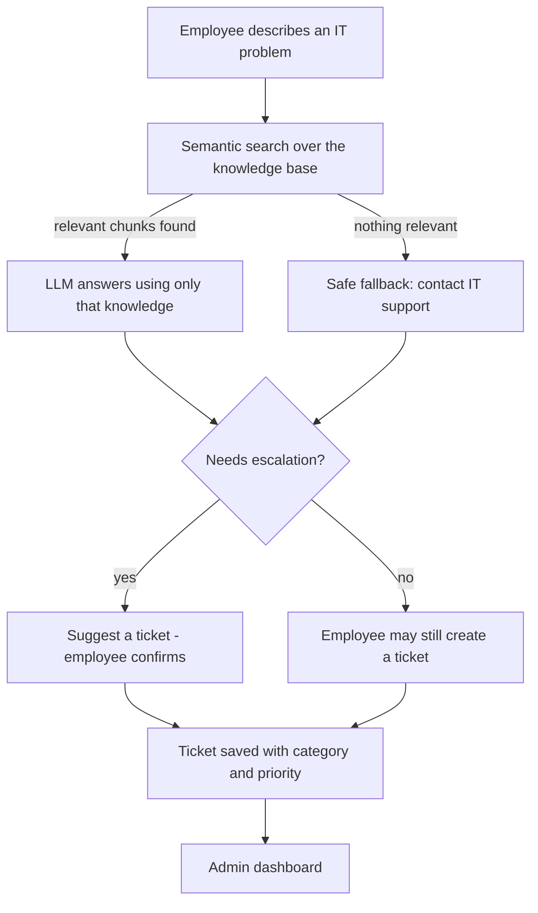

# 🤖 AI IT Support

An AI-powered internal IT helpdesk. Employees describe a problem in plain language, and the assistant searches the organization's IT knowledge base (Retrieval-Augmented Generation) and replies with step-by-step troubleshooting. If the issue needs a human, the employee can raise a support ticket that IT admins manage in a dashboard.

**🔗 Live demo:** 
https://ai-it-support-2nkfcr8aume46icjti5v9o.streamlit.app/
> The free host may put the app to sleep when it is idle. If you see a "wake up" screen, click it and wait about a minute.

---

## 🔑 Demo access (for reviewers)

| Role | Username | Password | What you can do |
|---|---|---|---|
| **Admin** | `admin` | `admin990` | Ticket dashboard, user management, plus everything an employee can do |
| **Employee** | `Employee1` | `12345678` | Ask the AI for help, get escalation advice, create tickets |

- These are **demo-only credentials** for evaluating this project. They are not used anywhere else.
- Usernames are not case-sensitive.
- It is a demo environment: data may reset when the app restarts, and the demo accounts and sample tickets are re-created automatically.
- Please don't change the demo passwords or delete the demo accounts, so the next reviewer can sign in.

### Suggested 3-minute walkthrough

1. Sign in as **Employee1** and ask: `My VPN is not connecting`. You get troubleshooting steps taken from the knowledge base.
2. Ask: `The VPN server is down for everyone in my team`. The app warns that the issue may need IT assistance. Click **Create Support Ticket**: it is filed as **VPN / Critical**.
3. Ask something unrelated, such as `How do I bake a chocolate cake?`. The assistant refuses to guess and points you to IT support.
4. Sign out and sign in as **admin**. Open the **Admin Dashboard** (summary numbers, category chart, filters, search, status updates, cleanup of resolved tickets) and **User Management** (create accounts, reset passwords).

---

## ✨ Features

- **RAG troubleshooting:** answers are generated only from the IT knowledge base (Wi-Fi, VPN, passwords, email, printers). If nothing relevant is found, the AI is not called and a safe fallback is returned.
- **Automatic escalation advice:** detects locked accounts, multiple users affected, unavailable services, suspected security incidents, and troubleshooting that already failed. The employee always confirms before a ticket is created.
- **Ticket intelligence:** each ticket gets a category (Wi-Fi, VPN, Password, Email, Printer, Security, General IT) and a priority (Low, Medium, High, Critical) using simple, explainable rules.
- **Roles and login:** separate Employee and Admin access. Passwords are stored as salted PBKDF2-SHA256 hashes, never in plain text.
- **Admin dashboard:** totals, status counts, tickets by category, filters, search, sorting, status updates, deletion of resolved tickets.
- **User management inside the app:** admins create accounts, reset passwords and delete accounts (the last admin cannot be deleted).
- **First-run setup and admin recovery** protected by a server-side setup code.

## 🧭 How it works



## 🛠️ Tech stack

- **Python** and **Streamlit** (UI and page navigation)
- **ChromaDB** with the `all-MiniLM-L6-v2` embedding model (run through ONNX)
- **OpenRouter** (OpenAI-compatible client) for the language model
- **SQLite** for tickets and users
- **python-dotenv** for configuration

## 📁 Project structure

```
ai-it-support/
├── app.py                  # entry point: setup / login / role-based pages
├── support_page.py         # employee support page
├── admin_page.py           # admin ticket dashboard
├── users_page.py           # admin user management
├── rag.py                  # chunking, embeddings, search, answer generation
├── escalation.py           # rule-based escalation detection
├── ticket_intelligence.py  # category and priority rules
├── tickets.py              # ticket database functions
├── auth.py                 # users, roles, password hashing, setup/recovery
├── bootstrap.py            # demo accounts and sample tickets from settings
├── create_user.py          # optional command-line account creation
├── knowledge/              # IT knowledge base (markdown)
│   ├── email.md
│   ├── password.md
│   ├── printer.md
│   ├── vpn.md
│   └── wifi.md
├── test_*.py               # automated tests
├── .streamlit/config.toml  # theme
└── requirements.txt
```

## 💻 Run locally

```bash
git clone https://github.com/Criminals226/ai-it-support.git
cd ai-it-support
python -m venv .venv
.venv\Scripts\Activate.ps1        # Windows PowerShell
pip install -r requirements.txt
```

Create a `.env` file in the project folder (never commit it):

```
OPENROUTER_API_KEY=your-key-here
SETUP_CODE=a-long-random-code-12-or-more-characters
```

Start the app:

```bash
streamlit run app.py
```

On the first run there is no admin yet, so the app shows a **First-time setup** screen. Enter your `SETUP_CODE` and choose an admin username and password.

### Configuration

| Setting | Purpose |
|---|---|
| `OPENROUTER_API_KEY` | API key for the language model (required for AI answers) |
| `OPENROUTER_MODEL` | Model name (default `openrouter/free`) |
| `SETUP_CODE` | Secret code (12+ characters) for first-time admin setup and admin password recovery |
| `BOOTSTRAP_ADMIN_USER`, `BOOTSTRAP_ADMIN_PASSWORD` | Optional: create this admin automatically at startup if missing |
| `BOOTSTRAP_EMPLOYEE_USER`, `BOOTSTRAP_EMPLOYEE_PASSWORD` | Optional: create this employee automatically at startup if missing |
| `SEED_DEMO_TICKETS` | Set to `true` to add sample tickets when there are none |

On the hosted demo these are set in the host's secrets, not in the code.

## ✅ Tests

```bash
python test_escalation.py
python test_ticket_intelligence.py
python test_auth.py
python test_auth_admin.py
python test_setup.py
python test_bootstrap.py
python test_ticket_delete.py
python rag.py            # prints retrieval results and distances for sample questions
```

The tests use temporary databases and do not touch real data.

## 🔒 Security notes

- Passwords are hashed with salted PBKDF2-SHA256 (600,000 iterations) and compared in constant time.
- Login errors never reveal whether the username or the password was wrong.
- Admin pages are hidden from employees and re-check the role on the page itself.
- Escalation and ticket rules are rule-based, so users cannot talk the system out of an escalation.
- The AI is instructed never to ask for passwords or MFA codes and never to suggest disabling security controls.
- Secrets live in environment variables or the host's secrets, never in the repository.

## 🚧 Limitations and roadmap

This is a working prototype, not yet a production system. Known gaps and planned work:

- **AI security hardening:** prompt-injection defenses, protection against prompt and knowledge-base extraction, login attempt limits and lockout, an audit log.
- **Conversation history:** follow-up questions in the same chat ("I already checked that").
- **Automation (n8n):** a webhook on ticket creation that sends email or chat notifications.
- **Knowledge management:** an admin page to add and edit knowledge articles inside the app.
- **Production storage:** a hosted database or persistent disk and backups (the free demo host can reset local files).
- **Company login (SSO)**, per-user rate limits, monitoring, and analytics such as the share of issues solved without a ticket.